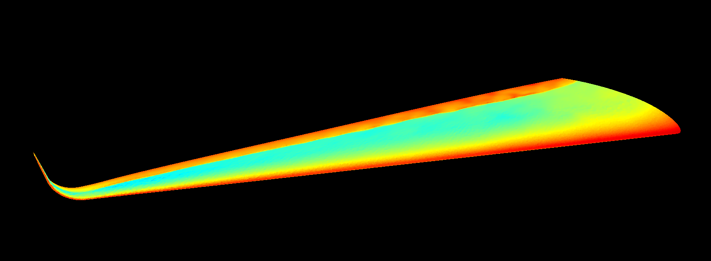

# *GRAPHITE*

*GRAPHITE* (Graphical Finite Volumes) is a finite volume project computing on the GPU. It aims to provide a 3D unstructured mesh second order finite volume solver for multiphysics problems.

*
Transonic flow over swept wing, 1.1 M cells, 7.3 min. on a GTX 1660 ti laptop
*

## Benchmarks

### Steady State Cases, 1e-3 convergence

| Case                        | RhoSimpleFoam, 6 MPI  | GRAPHITE, GTX 1660 ti | Speedup |
|-----------------------------|-----------------------|-----------------------|---------|
| Transonic Wing, 1.1 M cells | 1h                    | 7.4 min               | 8.1     |

## Compile & Run

You will need *nmake* to compile the project, and so you need to install Visual Studio if you don't have it already. Get the installer from https://visualstudio.microsoft.com/downloads/.

After that, edit the *src/main.cu* file to suit your multiphysics problem, and then compile from the root project directory using *nmake*. The compiled project will be named *graphite.exe* and can be run from the command line.

# Using this code in other projects

As no license is provided, the owner of this code does not authorize anyone to modify or distribute the code. This is not a definitive decision, if you have research goals, you can write to the author and a license authorizing research use could be added.

